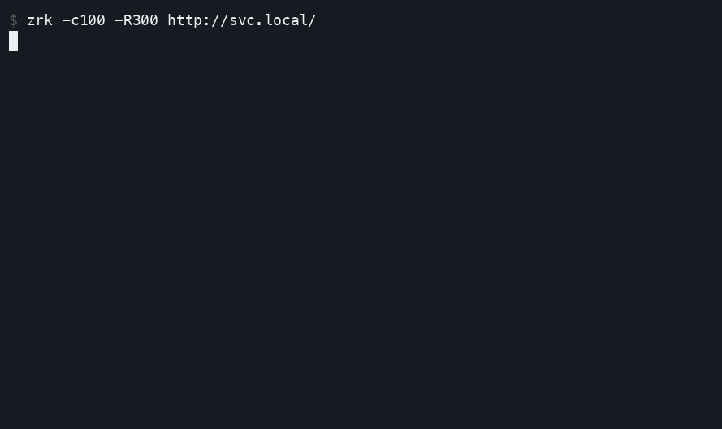

<p align="center">
    
</p>

# zrk

[](https://github.com/zoxy-io/zrk/actions/workflows/ci.yml)

A constant/linear throughput HTTP load generator — a Zig 0.16 rewrite of
[wrk2](https://github.com/giltene/wrk2) that paces every send in
**nanoseconds instead of wrk2's millisecond-grain scheduler**, plus a live
in-terminal dashboard of test progress.

Like wrk2, zrk generates load at a *fixed* request rate and reports latency
**corrected for coordinated omission** via an HdrHistogram, so tail latencies
aren't hidden when the server falls behind. Unlike wrk2, that correction isn't
riding on a scheduler that rounds every wait up to the next whole millisecond
— see [Why zrk is more accurate than wrk2](#why-zrk-is-more-accurate-than-wrk2)
below. zrk also continuously renders the latency percentile spectrum and a
p99 sparkline while the test runs.

## Why coordinated-omission correction?

An open-loop load tester that simply sends "as fast as the server answers"
accidentally *coordinates* with the server: when the server stalls, the tester
stops sending, so the stall never shows up in the latency numbers. zrk instead
paces each connection to a fixed schedule and measures every request's latency
from the time it *should* have been sent. If the server stalls, backlogged
requests accrue latency against their intended send time — the stall is
captured, not smoothed away.

## `--closed`: finding a ceiling instead of chasing one

Coordinated-omission correction has a precondition: you already know a rate
worth measuring against. That's fine for regression testing ("does this
service still hold 2000 req/s within its SLO?"), but it doesn't answer a
different, common question — "what's the most this service, with this many
connections, can actually sustain?" `-R` can't answer that on its own: pick a
rate at or under the true ceiling and you've only confirmed the service beats
your guess; pick one above it and the backlog *from that guess* grows for as
long as the run keeps pacing sends against a rate the server never agreed to,
swamping the latency histogram in queueing delay that has nothing to do with
the server's own response time.

`--closed` drops the schedule and sends each connection's next request the
instant its previous response completes — the classic wrk/ab model. There's
no independent send schedule left to correct against, so coordinated-omission
correction doesn't apply (and zrk says so: the final report reads "latency
(closed-loop round-trip)", not "corrected"), but the throughput that comes out
is real: it's however fast `-c` connections and the server, between them,
actually managed, not a target either side had to hit. That makes it the tool
for capacity discovery — find the ceiling once with `--closed`, then go back
to `-R` (below it, for a regression gate) or `-R start:end` (through it, to
see where latency breaks) now that there's a real number to aim at.

## Why zrk is more accurate than wrk2

Coordinated-omission correction is only as precise as the clock underneath
it, and wrk2's clock has a floor.

wrk2's event loop (`ae.c`, forked from Redis) drives an epoll wait and a timer
wheel that both resolve to whole milliseconds. Its per-request pacing computes
the exact microsecond wait until the next scheduled send
(`usec_to_next_send` in `wrk.c`), but then converts that into a timer delay
with:

```c
int msec_to_wait = round((time_usec_to_wait / 1000.0L) + 0.5);
```

That always rounds *up* to the next whole millisecond — a wait of 1 µs and a
wait of 999 µs both become a 1 ms wait. Because wrk2 correctly measures
latency from the *scheduled* send time (that's the coordinated-omission fix),
this scheduling overshoot isn't discarded — it lands directly in the recorded
latency of every sample that wasn't already overdue. The overshoot is uniform
on (0 ms, 1 ms], averaging ~0.5 ms: noise from the tool itself, not the
server, and indistinguishable from it in the report. At the sub-millisecond
latencies a fast service actually produces, that's not a rounding error —
it's frequently larger than the number being measured.

zrk's schedule (`src/pace.zig`) is a closed-form nanosecond offset per
connection send index, computed directly from the target rate (or ramp),
and each connection sleeps to it via [zio](https://github.com/lalinsky/zio)'s
io_uring runtime (`io.sleep(Io.Duration.fromNanoseconds(...))`). There is no
tick to round to.

## Installation

### Homebrew

```sh
brew install zoxy-io/tap/zrk
```

### Pre-built binary

Download the latest release binary from the [Releases page](https://github.com/zoxy-io/zrk/releases).
Linux and macOS, x86_64 and aarch64.

Windows binaries were dropped after v1.4.3. zrk's TLS is moving to
[ztls](https://github.com/zoxy-io/ztls), which is Linux and macOS by design —
its own scope note is "TLS 1.3 only, on Linux and macOS … no Windows
portability layer", and building it anywhere else is a compile error rather
than a degraded build. See [#21](https://github.com/zoxy-io/zrk/issues/21).

### Build from source

Requires Zig 0.16.

```sh
zig build                 # produces zig-out/bin/zrk
zig build -Doptimize=ReleaseFast
zig build test            # run the unit + integration tests
```

## Usage

```
zrk — constant-throughput HTTP load generator

Usage: zrk [options] <url>

Options:
  -t, --threads     <N>     Total number of threads to execute load (default 2)
  -c, --connections <N>     Total connections to keep open (default 10)
  -d, --duration    <T>     Test duration, e.g. 30s, 2m    (default 10s)
  -R, --rate      <N|A:B>   Target requests/second (total); A:B ramps
                            linearly from A to B over the run (default 1000)
      --closed              Closed-loop mode: ignore -R, send each
                            connection's next request the instant its
                            previous response completes (like wrk/ab).
                            No coordinated-omission correction; the rate
                            finds its own ceiling instead of chasing one.
                            Incompatible with a ramp (-R A:B) or --deadline
  -H, --header  <K: V>      Add a request header (repeatable)
  -m, --method      <M>     HTTP method                    (default GET)
  -b, --body     <S|@FILE>  Request body; @FILE reads it from a file
                            (@- = stdin, @@x = a literal "@x")
      --timeout     <T>     Wire timeout per attempt, from the actual
                            send (default 2s); does not bound CO latency
      --deadline    <T>     Max coordinated-omission latency, from the
                            scheduled send: a too-stale request is shed
                            (failed as a `deadline` error, not sent or
                            recorded) before sending (0 = off)
      --deadline-abort      Also abort in-flight requests past the
                            deadline. Resets the connection per miss and
                            churns under saturation; off by default
      --interval    <T>     Stats window: --timeseries rows and --plain
                            lines                          (default 1s)
      --refresh     <T>     Live dashboard redraw rate     (default 80ms)
      --latency             Print full latency spectrum in the final report
      --http2               Speak HTTP/2. Cleartext uses prior knowledge
                            (h2c); https negotiates it over ALPN and
                            fails the connection if the server declines
  -k, --insecure            Skip TLS certificate verification
      --plain               Append-only output instead of a live dashboard

Reporting:
      --format  <text|json> Final report format            (default text)
  -o, --output      <FILE>  Write the final report to FILE (default stdout)
      --hdr         <FILE>  Also write the HdrHistogram percentile
                            distribution (.hgrm) to FILE
      --timeseries  <FILE>  Stream per-interval NDJSON (throughput +
                            latency percentiles) to FILE
      --timeseries-histogram  Add each interval's full latency histogram
                            (HdrHistogram base64) to every --timeseries row
      --no-record-timeouts  Drop wire-timed-out requests from the latency
                            histogram (default: record them). Independent
                            of --deadline misses, which are never recorded.

CI gates (exit code 3 on breach):
      --slo-p99     <T>     Fail if final p99 latency exceeds T
      --max-error-rate <F>  Fail if error rate exceeds F (0..1)

  -h, --help                Show this help
      --version             Show version
```

Durations accept `us`, `ms`, `s`, `m`, `h` (a bare number is seconds).
Short options may be attached (`-c100`) or separated (`-c 100`).

### Interrupting a run

`Ctrl-C` (SIGINT) and SIGTERM both stop the run and still report what was
measured, rather than discarding it — useful when a long run has already shown
you what you needed, and the reason `docker stop` on a containerized run no
longer throws the measurement away.

The report covers the elapsed time, not `--duration`: `duration_s` is the real
figure and `--format json` adds `"interrupted": true`. CI gates are *not*
evaluated on an interrupted run, so a partial sample can never report a passing
`--slo-p99`. A second signal aborts immediately, without a report.

On the live dashboard the stop shows up on the panel itself: the blinking
recording dot beside the clock becomes a `✕` and a line under the counters says
the run is winding down (joining a large fleet takes a moment). Without a live
panel — `--plain`, a pipe, `--format json` — the notice goes to stderr instead.

Note for supervisors: the graceful stop has to tear down every connection, which
at high `-c` takes a moment, so allow some grace before SIGKILL (`docker stop`
defaults to 10s, which is ample).

### Exit codes

| code | meaning |
|------|---------|
| 0 | run completed; any configured gates passed |
| 1 | the run failed to start or complete (see the message on stderr) |
| 2 | bad arguments, or a `--body` file that could not be read |
| 3 | run completed but a `--slo-p99` / `--max-error-rate` gate was breached |
| 130 | interrupted by SIGINT (`Ctrl-C`); a partial report was still written |
| 143 | interrupted by SIGTERM; a partial report was still written |

### Examples

```sh
# 2000 req/s for 30s over 100 connections
zrk -c100 -d30s -R2000 http://127.0.0.1:8080/

# Ramp linearly from 100 to 5000 req/s over 60s, capturing the latency-vs-load
# curve as a per-interval NDJSON time series (find the knee where latency breaks)
zrk -c200 -d60s -R100:5000 --timeseries ramp.ndjson http://127.0.0.1:8080/

# HTTPS with the full latency spectrum in the final report
zrk -c20 -d1m -R500 --latency https://api.example.com/health

# POST with a body and custom headers
zrk -c10 -R100 -m POST -b '{"ping":1}' \
    -H 'Content-Type: application/json' http://127.0.0.1:8080/echo

# POST a body read from a file (@- reads stdin instead)
zrk -c10 -R100 -m POST -b @payload.json \
    -H 'Content-Type: application/json' http://127.0.0.1:8080/echo

# CI-friendly, no redrawing dashboard
zrk -c50 -R1000 -d20s --plain http://127.0.0.1:8080/ | tee run.log

# Machine-readable: JSON summary to a file + HdrHistogram .hgrm for plotting
zrk -c50 -R1000 -d20s --format json -o result.json --hdr latency.hgrm \
    http://127.0.0.1:8080/

# CI gate: fail the build (exit 3) if p99 regresses past 250ms or errors climb
zrk -c50 -R1000 -d20s --format json -o result.json \
    --slo-p99 250ms --max-error-rate 1% http://127.0.0.1:8080/

# Closed-loop: what's the real max throughput at 100 connections? No -R to
# guess — achieved_rate finds its own ceiling instead of chasing one.
zrk -c100 -d20s --closed http://127.0.0.1:8080/
```

The dashboard automatically falls back to append-only lines when stdout is not
a TTY, so piping just works.

## Machine-readable output

For embedding in a benchmark harness or CI, `--format json` emits a single
summary object (the live dashboard is suppressed) to stdout or `--output <file>`:

```json
{
  "zrk_version": "0.1.0",
  "target": { "url": "http://127.0.0.1:8080/", "method": "GET" },
  "config": { "connections": 50, "launched": 50, "duration_s": 20.000, "closed": false, "target_rate": 1000, "timeout_ms": 2000, "deadline_ms": 0, "deadline_abort": false, "record_timeouts": true },
  "duration_s": 20.002,
  "requests": 19998,
  "bytes": 1239876,
  "achieved_rate": 999.80,
  "target_rate": 1000,
  "rate_ratio": 0.9998,
  "bytes_per_sec": 61987.30,
  "error_rate": 0.000000,
  "max_schedule_lag_us": 84,
  "latency_us": { "min": 106, "mean": 422.0, "stdev": 1222.9, "max": 13991,
                  "p50": 251, "p75": 337, "p90": 471, "p99": 1913, "p99_9": 13364, "p99_99": 13988 },
  "status_codes": { "1xx": 0, "2xx": 19998, "3xx": 0, "4xx": 0, "5xx": 0 },
  "errors": { "connect": 0, "read": 0, "write": 0, "timeout": 0, "deadline": 0, "non_2xx_3xx": 0 },
  "latency_histogram": "HISTFAAAAUJ4nC1P..."
}
```

`latency_histogram` is the **complete** latency distribution encoded as an
HdrHistogram **V2 compressed** base64 blob — the same interchange format the
Java/Go/JS/Rust HdrHistogram libraries read. It decodes losslessly, so a harness
can store the raw histogram and later re-percentile it, diff two runs, or merge
many runs into one aggregate — none of which the summarized percentiles allow.
`zrk` can round-trip it too (`hdr.decodeBase64`), e.g. to merge prior runs.

`achieved_rate` / `rate_ratio` tell you whether the client actually sustained
the target load. **If `rate_ratio` is well below 1.0, the client was saturated
(one request in flight per connection — see Little's law below) and the latency
numbers reflect client backpressure, not the server: increase `-c`.**

Under `--closed` (`config.closed: true`), there's no offered rate to compare
against, so `target_rate` mirrors `achieved_rate` and `rate_ratio` is always
1.0 — a consumer that doesn't special-case `--closed` still gets coherent
numbers instead of the unrelated default `-R`.

`--hdr <file>` additionally writes the classic HdrHistogram percentile
distribution (values in milliseconds), directly loadable by the
[HdrHistogram plotter](https://hdrhistogram.github.io/HdrHistogram/plotFiles.html)
and format-compatible with wrk2's `--latency` output.

`--timeseries <file>` streams one NDJSON object per `--interval`, each carrying
that window's offered `target_rate`, `achieved_rate`, request/error counts,
transfer (`bytes`, `bytes_per_sec`), and a delta-histogram latency percentile
set:

```
{"t":1.006,"target_rate":480.0,"achieved_rate":476.2,"requests":476,"errors":0,"bytes":58852,"bytes_per_sec":58501.0,"latency_us":{"p50":245,"p90":669,"p99":1745,"p99_9":2401,"max":2401}}
```

This is the artifact a **ramp** (`-R A:B`) exists to produce: a curve of latency
against offered load, so you can find the rate at which the server's tail breaks
down. (The final summary's aggregate percentiles blend the whole ramp together,
so they're less useful for a ramp than the time series is.)

Add `--timeseries-histogram` to append each interval's **full** latency
distribution as an HdrHistogram V2 base64 blob (`latency_histogram`) to every
row. Each blob decodes losslessly, so a harness can re-percentile a single
interval or merge any subset of them — e.g. just the windows above a target
rate. Merging every row reproduces the run's summary histogram exactly, since
the intervals partition the run. (Rows get noticeably larger, so it is opt-in.)

Timed-out requests are recorded into the latency histogram by default (as a
coordinated-omission-corrected sample) so the tail isn't silently truncated;
`--no-record-timeouts` restores wrk2's drop-on-timeout behavior.

### `--timeout` vs `--deadline` (bounding the tail under overload)

These knobs sound similar but measure from **different clocks**, and the
difference only shows up under overload:

- **`--timeout`** is a **wire** timeout, measured from the *actual* send. It
  bounds one attempt on the wire (`done − actual_send`) and catches a hung
  socket or a dead server. It does **not** bound coordinated-omission latency:
  when a connection falls behind its schedule, each attempt still goes out and
  comes back quickly, so the timeout never trips even though the *recorded* CO
  latency (measured from the request's **scheduled** time) balloons into the
  tens of seconds. A tight `--timeout 1s` will happily sit next to a 30 s `p50`.
- **`--deadline`** is what actually bounds that tail. It is measured from each
  request's **scheduled** send time and targets `done − scheduled`. It is
  enforced by **shedding before sending**: a request already staler than the
  deadline is **failed as a `deadline` error** without ever touching the wire,
  which drains the backlog and keeps the client probing near-live latency. This
  is the usual benchmark intent ("past X ms it's a failed request, per our SLA").

With `--deadline` set, the latency histogram becomes the distribution of
requests that were **sent within the deadline** of their schedule, and sustained
overload shows up as a rising `deadline` error count instead of an unbounded
latency tail. That makes both CI gates meaningful at once under overload:
`--slo-p99` stays a p99 of *met* latency, while `--max-error-rate` catches the
deadline-miss rate. Deadline misses are **never** recorded into the histogram
(unlike wire timeouts), so `--no-record-timeouts` does not affect them.

Shedding bounds the send time, not the completion, so a request that *is* sent
still runs to completion on the wire: its recorded CO latency is bounded by
**deadline + wire time** (and wire time by `--timeout`), not by the deadline
exactly. zrk deliberately does **not** cut an in-flight request off by default,
because on HTTP/1.1 keep-alive that means resetting the connection — and under
saturation, where most in-flight requests exceed the deadline, resetting every
one storms the target with reconnects and can balloon its memory (an OOM risk
for the system under test). `--deadline-abort` opts into that in-flight cut-off
(recorded latency then capped at the deadline exactly), at the cost of a
connection reset per miss; use it only against a target you know tolerates the
churn.

`max_schedule_lag_us` (JSON) / "Peak schedule lag" (text report) is the backlog
gauge: the peak `now − scheduled` the fleet ever reached. It is populated even
without `--deadline`, so it is an early warning that the client is falling
behind the offered schedule — a companion to `rate_ratio` / `achieved_rate`.

## How it works

- **One request in flight per connection** (like wrk/wrk2). Throughput comes
  from running many connections; the total `-R` rate is split evenly across
  them, and each connection paces its own sends to that schedule.
- **HdrHistogram** records every request's corrected latency (1µs–60s, 3
  significant figures). Each connection owns its own histogram (lock-free hot
  path) and publishes a snapshot once per `--interval` for the dashboard; the
  final report aggregates all histograms after the run. Latencies above 60s are
  clamped into the top bucket rather than dropped, so the request is still
  counted but the reported tail saturates there. Two histograms per connection
  at ~136KiB each is the bulk of zrk's memory: budget ~280KiB per `-c`.
- Connections run as coroutines on a [zio](https://github.com/lalinsky/zio)
  io_uring runtime (`std.Io`-compatible), one connection per coroutine.

## Library usage

zrk's core is a reusable Zig module, not just a CLI: `runner.run` drives the
same load-test loop the CLI does (see `src/runner.zig`) and returns a typed
`Report`, with an optional progress callback for the periodic snapshots the
dashboard renders. The lower-level pieces it's built from (`hdr`, `cli`,
`http`, `connection`, `stats`, `report`, `tls`) are exported too.

Add it as a dependency:

```sh
zig fetch --save git+https://github.com/zoxy-io/zrk#<commit-or-tag>
```

```zig
// build.zig
const zrk_dep = b.dependency("zrk", .{ .target = target, .optimize = optimize });
exe.root_module.addImport("zrk", zrk_dep.module("zrk"));
```

`runner.run` takes a `std.Io` instance as a plain parameter, so any conforming
`std.Io` implementation can be passed in. In practice, zrk dials each
connection with a connect timeout (`address.connect(io, .{ .timeout = ... })`),
and Zig 0.16's default `std.Io.Threaded` backend hasn't implemented
connect-with-timeout yet (it's a TODO panic there). [zio](https://github.com/lalinsky/zio)
does implement it, which is why zio is a hard dependency of the `zrk` package
itself (see `build.zig.zon`) and the runtime zrk's own CLI constructs at
startup (`src/main.zig`). Embedders should do the same — construct a
`zio.Runtime` and pass its `.io()` to `runner.run` — unless you bring another
`std.Io` implementation that you've verified covers what zrk needs.

```zig
const std = @import("std");
const zio = @import("zio");
const zrk = @import("zrk");

var rt = try zio.Runtime.init(allocator, .{});
defer rt.deinit();
const io = rt.io();

var arena = std.heap.ArenaAllocator.init(allocator);
defer arena.deinit();

var cfg: zrk.cli.Config = .{
    .connections = 50,
    .rate = 1000,
    .duration_ns = 10 * std.time.ns_per_s,
    .interval_ns = 1 * std.time.ns_per_s,
    .url = try zrk.cli.parseUrl("http://127.0.0.1:8080/"),
};
const report = try zrk.runner.run(arena.allocator(), io, &cfg, 0, null, null);
```

## Source layout

| File | Responsibility |
|------|----------------|
| `src/hdr.zig` | Minimal HdrHistogram (record, percentiles, merge). |
| `src/cli.zig` | Argument / URL / duration parsing → `Config`. |
| `src/http.zig` | Request builder (HTTP/1.1 bytes and the HPACK block); response framing is [zurl](https://github.com/zoxy-io/zurl)'s. |
| `src/connection.zig` | The per-connection pacing loop (the coordinated-omission core). |
| `src/tls.zig` | TLS session setup over a stream (system CA bundle, `-k`). |
| `src/stats.zig` | Per-connection state ownership + snapshot/final aggregation. |
| `src/report.zig` | Machine-readable JSON summary + SLO/CI exit-code gates. |
| `src/tui.zig` | Live dashboard and final report. |
| `src/main.zig` | Orchestration: resolve, launch connections, drive the dashboard. |

## Limitations (v1)

- HTTP/1.1 only; a single fixed request per run (no scripting).
- `--timeout` bounds the **wire attempt** from the actual send (a response that
  doesn't arrive in time is abandoned and counted as `Socket errors: ... timeout
  N`, matching wrk2). It does **not** bound coordinated-omission latency under
  overload — use `--deadline` for that (see "`--timeout` vs `--deadline`"
  above). The *connect* itself still uses the OS default, since
  connect-with-timeout is unimplemented in the std backend and panics.
- `-k` skips certificate verification; with the std TLS client this also omits
  SNI, so name-based virtual hosts may respond differently under `-k`.
